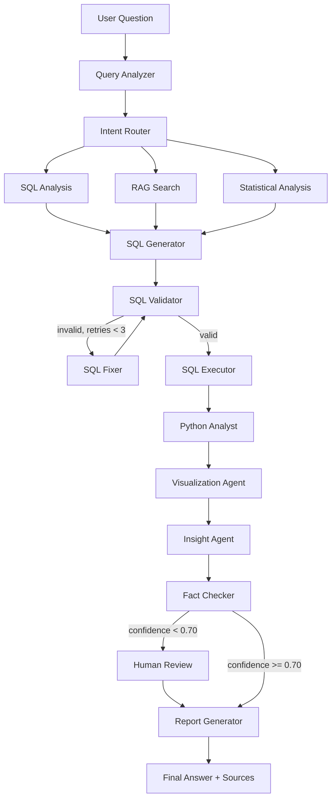

# AI Data Analyst Agent — LangGraph + RAG

An agentic AI platform that lets a user ask natural-language questions about
business data ("Why did revenue decrease in July?") and get back a verified,
sourced answer: generated SQL, statistical analysis, charts, and insights —
backed by a real multi-agent [LangGraph](https://github.com/langchain-ai/langgraph)
workflow with retrieval-augmented generation (RAG) over business documentation.

> **Status:** 🚧 Phase 1 of 12 complete — repository architecture and scaffolding.
> The system is not yet functional end-to-end; see [Roadmap](#roadmap).

## Project Overview

Business users constantly ask questions that require joining tabular data
(orders, customers, products) with tribal/business knowledge (KPI definitions,
policies, product documentation). This project builds an **agentic data
analyst** that:

1. Understands the question and its intent (metric, dimensions, period, analysis type).
2. Inspects the live database schema.
3. Retrieves relevant business context via RAG (pgvector) when needed.
4. Generates and validates read-only SQL against PostgreSQL.
5. Runs statistical analysis in Python (pandas / numpy / scipy).
6. Produces the appropriate Plotly visualization.
7. Turns results into a narrative insight, fact-checks every number, and
   returns a final answer with sources — never inventing figures.

This is not a "chat with your CSV" demo: it is a real multi-agent, tool-using,
conditionally-routed, retryable LangGraph application with memory and
human-in-the-loop review, exposed through a FastAPI backend and a React
frontend.

## Planned LangGraph Workflow



## Multi-Agent Architecture

| Agent | Responsibility |
|---|---|
| **Query Analyzer** | Extracts intent, metric, dimensions, period, analysis type, required sources |
| **Schema Agent** | Inspects PostgreSQL (tables, columns, types, relations, sample values, stats) |
| **SQL Generator** | Produces PostgreSQL queries from intent + schema + RAG context |
| **SQL Validator** | Rejects write operations, enforces read-only, checks tables/columns/syntax |
| **SQL Fixer** | Repairs invalid SQL, up to 3 attempts |
| **Python Data Analyst** | Descriptive stats, group comparison, trends, correlations, anomaly detection, contribution analysis |
| **Visualization Agent** | Auto-selects chart type (line, bar, histogram, scatter, heatmap, stacked bar) via Plotly |
| **Insight Agent** | Turns results into narrative conclusions, grounded only in real computed numbers |
| **Fact Checker** | Verifies every number, percentage, and claim before the answer is returned |
| **Report Generator** | Assembles the final answer with SQL, charts, insights, and sources |

## RAG Architecture

```text
Business documents (glossary, KPI definitions, product docs,
financial definitions, sales docs, regional info, policies)
        │
        ▼
     Loader → Chunking → Embeddings → pgvector → Retriever
```

RAG supplies **business context for interpretation**; it never replaces SQL
for querying tabular data.

## Tech Stack

**Backend:** Python 3.12+, FastAPI, LangGraph, LangChain, Pydantic, PostgreSQL,
pgvector, Pandas, NumPy, SciPy, Plotly, SQLAlchemy, pytest.

**Frontend:** React, Vite, TypeScript, Tailwind CSS, Axios.

**LLM providers (configurable via `.env`):** OpenAI, Anthropic, Google Gemini.

**Observability (optional):** LangSmith tracing — the app works fully without it.

> No Docker. The project runs directly on the development machine; PostgreSQL
> runs as a local service.

## Repository Structure

```text
AI_Data_Analyst_Agent__LangGraph_RAG/
│
├── backend/
│   ├── app/
│   │   ├── agents/       # Query Analyzer, SQL Generator, Insight Agent, ...
│   │   ├── graph/        # LangGraph state, nodes, edges, conditional routing
│   │   ├── tools/        # LangChain tools (SQL execution, schema inspection, ...)
│   │   ├── rag/          # Loader, chunking, embeddings, pgvector retriever
│   │   ├── database/     # SQLAlchemy engine, session, models
│   │   ├── models/       # Pydantic schemas (request/response, agent state)
│   │   ├── services/     # Business/orchestration logic
│   │   ├── api/          # FastAPI routers
│   │   └── core/         # Settings, config, security
│   ├── tests/
│   ├── requirements.txt
│   ├── pytest.ini
│   └── main.py
│
├── frontend/
│   ├── src/
│   │   ├── components/
│   │   ├── pages/
│   │   ├── hooks/
│   │   ├── services/
│   │   └── types/
│   └── package.json
│
├── data/                 # Demo dataset (raw/processed), gitignored
├── evaluation/           # Evaluation questions, evaluate.py, reports
├── docs/                 # Additional documentation, diagrams, screenshots
├── .env.example
├── README.md
└── LICENSE
```

## Installation

### Prerequisites

- **Python 3.12+**
- **PostgreSQL 15+** with the **pgvector** extension
- **Node.js 20+ / npm** (installed via [nvm](https://github.com/nvm-sh/nvm) is recommended)

### 1. PostgreSQL + pgvector (local)

Install PostgreSQL locally (e.g. `sudo apt install postgresql`), then enable
pgvector for your database:

```sql
CREATE DATABASE ai_data_analyst;
\c ai_data_analyst
CREATE EXTENSION IF NOT EXISTS vector;
```

> Full setup, seed data, and schema migrations are added in Phase 2.

### 2. Backend

```bash
cd backend
python -m venv .venv

# Linux/macOS
source .venv/bin/activate
# Windows
.venv\Scripts\activate

pip install -r requirements.txt
cp ../.env.example .env   # then fill in DATABASE_URL and your LLM API key
```

Run it:

```bash
uvicorn main:app --reload
```

Check it's alive: `GET http://localhost:8000/api/health`

Run tests:

```bash
pytest
```

### 3. Frontend

```bash
cd frontend
npm install
npm run dev
```

Open the printed local URL (default `http://localhost:5173`).

## Configuration (`.env`)

See [`.env.example`](.env.example) for the full list. Key variables:

| Variable | Purpose |
|---|---|
| `DATABASE_URL` | PostgreSQL connection string |
| `LLM_PROVIDER` | `openai` \| `anthropic` \| `gemini` |
| `OPENAI_API_KEY` / `ANTHROPIC_API_KEY` / `GOOGLE_API_KEY` | LLM provider credentials |
| `LANGCHAIN_TRACING_V2` / `LANGCHAIN_API_KEY` | Optional LangSmith observability |
| `MAX_SQL_ROWS`, `SQL_TIMEOUT_SECONDS` | SQL execution safety limits |
| `CONFIDENCE_THRESHOLD` | Threshold below which human-in-the-loop review is triggered |

Secrets are never hardcoded; they are read exclusively from `.env`.

## Roadmap

- [x] **Phase 1** — Architecture and repository structure
- [ ] **Phase 2** — PostgreSQL + pgvector + demo dataset
- [ ] **Phase 3** — RAG pipeline
- [ ] **Phase 4** — LangGraph state and agents
- [ ] **Phase 5** — SQL generation, validation, execution
- [ ] **Phase 6** — Python Data Analyst agent
- [ ] **Phase 7** — Visualization agent
- [ ] **Phase 8** — Fact checking and report generation
- [ ] **Phase 9** — FastAPI endpoints and streaming
- [ ] **Phase 10** — React frontend
- [ ] **Phase 11** — Tests and evaluation harness
- [ ] **Phase 12** — Full documentation and polish

## Security

- Read-only SQL execution: `DROP`, `DELETE`, `UPDATE`, `INSERT`, `ALTER`,
  `TRUNCATE`, `CREATE` are rejected by the SQL Validator.
- Row limits and query timeouts on every SQL execution.
- File upload size/type validation.
- All secrets loaded from `.env`, never hardcoded.

## License

[MIT](LICENSE)
