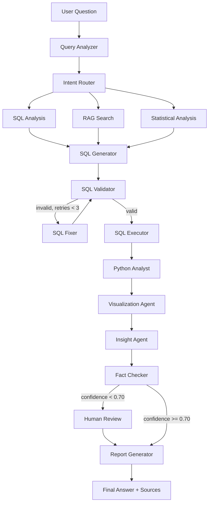

# AI Data Analyst Agent — LangGraph + RAG

An agentic AI platform that lets a user ask natural-language questions about
business data ("Why did revenue decrease in July?") and get back a verified,
sourced answer: generated SQL, statistical analysis, charts, and insights —
backed by a real multi-agent [LangGraph](https://github.com/langchain-ai/langgraph)
workflow with retrieval-augmented generation (RAG) over business documentation.

> **Status:** 🚧 Phase 8 of 12 complete — the full pipeline runs end-to-end
> against real infrastructure: SQL generation, statistical analysis, charts,
> a fact-checked narrative answer, and human-in-the-loop review for
> low-confidence claims. The system is not yet exposed via API/UI; see
> [Roadmap](#roadmap).

## Project Overview

Business users constantly ask questions that require joining tabular data
(orders, customers, products) with tribal/business knowledge (KPI definitions,
policies, product documentation). This project builds an **agentic data
analyst** that:

1. Understands the question and its intent (metric, dimensions, period, analysis type).
2. Inspects the live database schema.
3. Retrieves relevant business context via RAG (pgvector) when needed.
4. Generates and validates read-only SQL against PostgreSQL.
5. Runs statistical analysis in Python (pandas / numpy / scipy).
6. Produces the appropriate Plotly visualization.
7. Turns results into a narrative insight, fact-checks every number, and
   returns a final answer with sources — never inventing figures.

This is not a "chat with your CSV" demo: it is a real multi-agent, tool-using,
conditionally-routed, retryable LangGraph application with memory and
human-in-the-loop review, exposed through a FastAPI backend and a React
frontend.

## Planned LangGraph Workflow



## Multi-Agent Architecture

| Agent | Responsibility |
|---|---|
| **Query Analyzer** | Extracts intent, metric, dimensions, period, analysis type, required sources |
| **Schema Agent** | Inspects PostgreSQL (tables, columns, types, relations, sample values, stats) |
| **SQL Generator** | Produces PostgreSQL queries from intent + schema + RAG context |
| **SQL Validator** | Rejects write operations, enforces read-only, checks tables/columns/syntax |
| **SQL Fixer** | Repairs invalid SQL, up to 3 attempts |
| **Python Data Analyst** | Descriptive stats, group comparison, trends, correlations, anomaly detection, contribution analysis |
| **Visualization Agent** | Auto-selects chart type (line, bar, histogram, scatter, heatmap, stacked bar) via Plotly |
| **Insight Agent** | Turns results into narrative conclusions, grounded only in real computed numbers |
| **Fact Checker** | Verifies every number, percentage, and claim before the answer is returned |
| **Report Generator** | Assembles the final answer with SQL, charts, insights, and sources |

## RAG Architecture

```text
Business documents (glossary, KPI definitions, product docs,
financial definitions, sales docs, regional info, policies)
        │
        ▼
     Loader → Chunking → Embeddings → pgvector → Retriever
```

RAG supplies **business context for interpretation**; it never replaces SQL
for querying tabular data.

14 business documents ship under [`data/business_docs/`](data/business_docs)
across seven categories: glossary, KPI definitions, product documentation,
financial definitions, sales documentation, regional information, and
company policies.

Ingest them (requires `OPENAI_API_KEY`, or `GOOGLE_API_KEY` if
`EMBEDDING_PROVIDER=gemini`):

```bash
cd backend
python scripts/ingest_documents.py
```

The loader, chunker, and pgvector retriever are covered by tests that use a
deterministic fake embedder (`backend/tests/test_rag_*.py`), so the test
suite verifies the full store → cosine-search round trip against the real
local Postgres/pgvector instance without requiring a paid API key.

## LangGraph Workflow — current implementation status

Phase 4 wires up the first stretch of the graph against real infrastructure:

- **Query Analyzer** (`app/agents/query_analyzer.py`) — an LLM constrained to
  structured output (`QueryAnalysis`: metric, period, analysis type,
  dimensions, and which downstream capabilities are needed).
- **Schema Agent** (`app/agents/schema_agent.py`) — inspects the *live*
  PostgreSQL schema (tables, columns, types, foreign keys, sample values,
  row counts) so the future SQL Generator never works from a stale
  hardcoded description.
- **Intent Router** — a conditional edge that fans out to whichever of RAG
  search / SQL analysis / statistical analysis the question actually needs.
- **RAG Search** — the real Phase 3 pgvector retriever, wired in as a graph
  branch.
- **Checkpointing** — the graph is compiled with `MemorySaver`, so
  conversation state persists across invocations sharing a `thread_id`.

Statistical analysis and chart generation are wired in as of Phase 6/7 —
see [Python Data Analyst (Phase 6)](#python-data-analyst-phase-6) and
[Visualization Agent (Phase 7)](#visualization-agent-phase-7) below.

Since the Query Analyzer needs an LLM call, `build_graph()` takes its
dependencies (analyzer, DB engine, embeddings, SQL generator/fixer) as
arguments rather than constructing them internally. `build_default_graph()`
wires in the real providers from `.env`; tests (`backend/tests/test_graph_*.py`)
inject fakes, so the graph's structure, conditional routing, and
checkpointing are verified without a paid API key.

### SQL generation, validation, and execution (Phase 5)

The `sql_generator` branch is now a full retry loop, not a placeholder:

```text
SQL Generator --> SQL Validator --(invalid, retries left)--> SQL Fixer --> SQL Validator
                        |                                                       ^
                  (valid)|                                                      |
                        v                                              (loops back)
                  SQL Executor                    (invalid, retries exhausted)
                                                            |
                                                            v
                                                        Give Up
```

- **SQL Generator / SQL Fixer** (`app/agents/sql_generator.py`,
  `app/agents/sql_fixer.py`) — LLMs constrained to structured
  `{sql, reasoning}` output, prompted with the live schema, the extracted
  intent, and any RAG business context.
- **SQL Validator** (`app/tools/sql_validator.py`) — deterministic, LLM-free.
  Rejects `DROP`/`DELETE`/`UPDATE`/`INSERT`/`ALTER`/`TRUNCATE`/`CREATE`,
  requires a single `SELECT` statement (blocking stacked-statement
  injection), and checks every referenced table/column against the live
  schema.
- **SQL Executor** (`app/tools/sql_executor.py`) — runs validated SQL in a
  `READ ONLY` transaction with a `statement_timeout` and a hard row cap
  (defense in depth: even a query that slips past validation cannot write
  or run away).
- The Fixer loop retries up to `MAX_SQL_FIX_ATTEMPTS` (default 3, see
  `.env.example`) before giving up and recording the failure instead of
  silently dropping it.

`backend/tests/test_sql_validator.py` and `test_sql_executor.py` cover the
security properties directly (forbidden keywords, injection via stacked
statements, unknown tables/columns, read-only enforcement, timeouts, row
caps) against the real local database; `test_sql_graph_integration.py`
exercises the full retry loop and give-up path inside the compiled graph
with fake LLMs.

### Python Data Analyst (Phase 6)

Statistics have no data of their own in this system — everything lives in
PostgreSQL — so the Python Data Analyst is not an independent branch off
the Intent Router as originally sketched. Instead, `requires_statistics`
now pulls the question into the SQL branch (`app/graph/routing.py`,
`route_after_query_analysis`), and the analyst runs *after* the SQL
Executor succeeds, over its actual result rows (`route_after_sql_execution`):

```text
SQL Executor --(requires_statistics and rows exist)--> Python Analyst --> Join
             --(otherwise)--------------------------------------------> Join
```

- **Python Data Analyst** (`app/tools/python_analyst.py`) — deterministic,
  LLM-free, like the SQL Validator/Executor: every number handed to the
  future Insight Agent must be reproducible from the SQL result set, not
  generated by a model. It loads the rows into a pandas DataFrame and
  dispatches on the Query Analyzer's `analysis_type`:
  - `descriptive` → count/mean/median/std/min/max/sum on the resolved metric column.
  - `comparison` / `ranking` → group-by on the first dimension column, sorted by sum.
  - `trend` → sorts by a detected date/period column and fits a linear
    regression (`scipy.stats.linregress`) for direction, slope, and percent change.
  - `correlation` → Pearson correlation (`scipy.stats.pearsonr`) between the
    metric and every other numeric column, ranked by strength.
  - `anomaly_detection` → flags rows whose metric z-score exceeds 2.5.
  - `root_cause` → contribution analysis: each dimension group's share of
    the total, to surface what's driving a change.
- PostgreSQL `NUMERIC` columns come back from psycopg as `decimal.Decimal`,
  which pandas stores as dtype `object` and would otherwise be invisible to
  numeric detection — `python_analyst.py` coerces those columns first so
  money/quantity metrics are actually picked up.
- Every handler raises a typed `_AnalysisError` for expected failure modes
  (no dimension to group by, a flat series with zero variance, ...), which
  `analyze()` turns into `PythonAnalysisResult.error` instead of crashing
  the graph; a missing numeric column is caught even earlier, before any
  handler runs.
- The Decimal-coercion and metric/time-column resolution helpers live in
  `app/tools/tabular.py`, shared with the Visualization Agent below so both
  tools treat the same SQL row shape identically.

`backend/tests/test_python_analyst.py` unit-tests every analysis type
directly (including the Decimal-coercion behavior) with no DB or LLM
required; `test_graph_python_analyst_integration.py` and the updated
`test_graph_routing.py` verify the node only runs when statistics are
needed and SQL rows exist, inside the compiled graph.

### Visualization Agent (Phase 7)

Also deterministic and LLM-free, and deliberately independent from the
Python Data Analyst: it reads the same raw SQL rows directly, so a chart is
still produced for a plain SQL question that never asked for statistics.
Wired in right after the SQL Executor:

```text
SQL Executor --(requires_statistics)--> Python Analyst --> Visualization Agent --> Join
             --(otherwise, rows exist)-------------------> Visualization Agent --> Join
             --(no rows)---------------------------------------------------------> Join
```

- **Visualization Agent** (`app/tools/visualization.py`) — picks a Plotly
  chart type from the Query Analyzer's `analysis_type` and the shape of the
  result set, and returns the figure as a plain JSON-serializable dict
  (`json.loads(plotly.io.to_json(fig))`, so no numpy/pandas types leak into
  graph state):
  - `trend` → line chart over the detected date/period column.
  - `comparison` / `ranking` / `root_cause` → bar chart grouped by the first
    dimension; a **second** dimension switches automatically to a stacked
    bar chart (pivoted, one trace per subgroup).
  - `correlation` → a correlation-matrix heatmap across all numeric columns.
  - `anomaly_detection` → a scatter plot with outlier points (|z-score| > 2.5)
    highlighted in a different color.
  - `descriptive`, or any unrecognized `analysis_type` → a histogram of the
    metric's distribution, or a bar chart if a dimension is available.

`backend/tests/test_visualization.py` unit-tests every chart type directly
(including the stacked-bar and anomaly-highlighting behavior) with no DB or
LLM required; the graph-integration tests confirm the chart is produced
whenever there are SQL rows, whether or not statistics were requested.

### Insight Agent, Fact Checker, and Report Generator (Phase 8)

Wired in right after the Join node, so it runs regardless of which upstream
branches fired (RAG only, SQL only, SQL + statistics, or nothing at all):

```text
Join -> Insight Agent -> Fact Checker -(confidence < threshold)-> Human Review -> Report Generator -> END
                                       -(confidence >= threshold)-------------------> Report Generator -> END
```

- **Insight Agent** (`app/agents/insight_agent.py`) — an LLM constrained to
  structured output (`InsightGeneration`): a short narrative answer, plus a
  `claims` list extracting every specific number/percentage the narrative
  states. Prompted with the Query Analyzer's intent, any RAG context, and a
  bounded `data_context` summary (the Python Analyst's already-aggregated
  `summary`/`table` when available — small, verified numbers — falling back
  to a capped sample of raw SQL rows otherwise, so a 10,000-row result never
  blows the prompt).
- **Fact Checker** (`app/tools/fact_checker.py`) — deterministic and
  LLM-free, like the SQL Validator, Python Analyst, and Visualization Agent:
  an LLM checking another LLM's numbers proves nothing. It flattens every
  numeric value out of `python_analysis` (summary + table) and the raw SQL
  rows into a pool of "trusted values," then checks each claim's asserted
  number against that pool (within a small relative/absolute tolerance).
  `confidence` is the fraction of claims that verified; a narrative with no
  numeric claims at all trivially has nothing false to report, so it
  verifies at full confidence.
- **Human Review** (`app/graph/nodes.py::human_review_node`) — when
  confidence falls below `CONFIDENCE_THRESHOLD` (default 0.70), the graph
  genuinely pauses using LangGraph's `interrupt()`/`Command(resume=...)`
  mechanism (backed by the `MemorySaver` checkpointer already compiled into
  the graph — see Phase 4), handing a human reviewer the narrative, its
  confidence, and the Fact Checker's notes. Resuming with
  `{"approved": bool, "reviewer_notes": str, "edited_narrative": str | None}`
  lets the reviewer approve as-is or correct the narrative before the report
  is assembled. This is a real pause/resume, not a placeholder: the graph
  actually stops mid-execution and `graph.get_state(config).next` reports
  it's waiting on the human-review node until resumed.
- **Report Generator** (`app/tools/report_generator.py`) — deterministic
  assembly only, no LLM: packages the narrative, confidence, SQL, chart,
  fact-check notes, RAG sources, and any upstream errors into the
  `final_report` returned to the caller.

`backend/tests/test_insight_agent.py`, `test_fact_checker.py`, and
`test_report_generator.py` unit-test each piece directly;
`test_graph_insight_report_integration.py` exercises the full tail inside
the compiled graph against a real Postgres instance, including a genuine
interrupt-then-resume cycle for a deliberately unverifiable claim.

## Tech Stack

**Backend:** Python 3.12+, FastAPI, LangGraph, LangChain, Pydantic, PostgreSQL,
pgvector, Pandas, NumPy, SciPy, Plotly, SQLAlchemy, pytest.

**Frontend:** React, Vite, TypeScript, Tailwind CSS, Axios.

**LLM providers (configurable via `.env`):** OpenAI, Anthropic, Google Gemini.

**Observability (optional):** LangSmith tracing — the app works fully without it.

> No Docker. The project runs directly on the development machine; PostgreSQL
> runs as a local service.

## Repository Structure

```text
AI_Data_Analyst_Agent__LangGraph_RAG/
│
├── backend/
│   ├── app/
│   │   ├── agents/       # Query Analyzer, SQL Generator, Insight Agent, ...
│   │   ├── graph/        # LangGraph state, nodes, edges, conditional routing
│   │   ├── tools/        # LangChain tools (SQL execution, schema inspection, ...)
│   │   ├── rag/          # Loader, chunking, embeddings, pgvector retriever
│   │   ├── database/     # SQLAlchemy engine, session, models
│   │   ├── models/       # Pydantic schemas (request/response, agent state)
│   │   ├── services/     # Business/orchestration logic
│   │   ├── api/          # FastAPI routers
│   │   └── core/         # Settings, config, security
│   ├── tests/
│   ├── requirements.txt
│   ├── pytest.ini
│   └── main.py
│
├── frontend/
│   ├── src/
│   │   ├── components/
│   │   ├── pages/
│   │   ├── hooks/
│   │   ├── services/
│   │   └── types/
│   └── package.json
│
├── data/                 # Demo dataset (raw/processed), gitignored
├── evaluation/           # Evaluation questions, evaluate.py, reports
├── docs/                 # Additional documentation, diagrams, screenshots
├── .env.example
├── README.md
└── LICENSE
```

## Installation

### Prerequisites

- **Python 3.12+**
- **PostgreSQL 15+** with the **pgvector** extension
- **Node.js 20+ / npm** (installed via [nvm](https://github.com/nvm-sh/nvm) is recommended)

### 1. PostgreSQL + pgvector (local)

Install PostgreSQL locally (e.g. `sudo apt install postgresql`), then enable
pgvector for your database:

```sql
CREATE ROLE ai_data_analyst WITH LOGIN PASSWORD 'change-me';
CREATE DATABASE ai_data_analyst OWNER ai_data_analyst;
\c ai_data_analyst
CREATE EXTENSION IF NOT EXISTS vector;
```

### 2. Backend

```bash
cd backend
python -m venv .venv

# Linux/macOS
source .venv/bin/activate
# Windows
.venv\Scripts\activate

pip install -r requirements.txt
cp ../.env.example .env   # then fill in DATABASE_URL and your LLM API key
```

Apply the database schema:

```bash
alembic upgrade head
```

Run it:

```bash
uvicorn main:app --reload
```

Check it's alive: `GET http://localhost:8000/api/health`

Run tests:

```bash
pytest
```

### 2b. Demo dataset

Generates a realistic dataset (56k orders, 1,500 customers, 130 products,
seasonality, regional differences, anomalies, a genuine revenue-decline
story in the most recent month, and a few realistic missing values) and
loads it into PostgreSQL:

```bash
python data/generate_dataset.py        # writes CSVs to data/raw/
cd backend && python scripts/seed_database.py
```

Re-running `seed_database.py` truncates and reloads all tables, so it is
safe to run again after regenerating the CSVs.

### 3. Frontend

```bash
cd frontend
npm install
npm run dev
```

Open the printed local URL (default `http://localhost:5173`).

## Configuration (`.env`)

See [`.env.example`](.env.example) for the full list. Key variables:

| Variable | Purpose |
|---|---|
| `DATABASE_URL` | PostgreSQL connection string |
| `LLM_PROVIDER` | `openai` \| `anthropic` \| `gemini` |
| `OPENAI_API_KEY` / `ANTHROPIC_API_KEY` / `GOOGLE_API_KEY` | LLM provider credentials |
| `LANGCHAIN_TRACING_V2` / `LANGCHAIN_API_KEY` | Optional LangSmith observability |
| `MAX_SQL_ROWS`, `SQL_TIMEOUT_SECONDS` | SQL execution safety limits |
| `CONFIDENCE_THRESHOLD` | Threshold below which human-in-the-loop review is triggered |

Secrets are never hardcoded; they are read exclusively from `.env`.

## Roadmap

- [x] **Phase 1** — Architecture and repository structure
- [x] **Phase 2** — PostgreSQL + pgvector + demo dataset
- [x] **Phase 3** — RAG pipeline
- [x] **Phase 4** — LangGraph state and agents
- [x] **Phase 5** — SQL generation, validation, execution
- [x] **Phase 6** — Python Data Analyst agent
- [x] **Phase 7** — Visualization agent
- [x] **Phase 8** — Fact checking and report generation
- [ ] **Phase 9** — FastAPI endpoints and streaming
- [ ] **Phase 10** — React frontend
- [ ] **Phase 11** — Tests and evaluation harness
- [ ] **Phase 12** — Full documentation and polish

## Security

- Read-only SQL execution: `DROP`, `DELETE`, `UPDATE`, `INSERT`, `ALTER`,
  `TRUNCATE`, `CREATE` are rejected by the SQL Validator.
- Row limits and query timeouts on every SQL execution.
- File upload size/type validation.
- All secrets loaded from `.env`, never hardcoded.

## License

[MIT](LICENSE)
